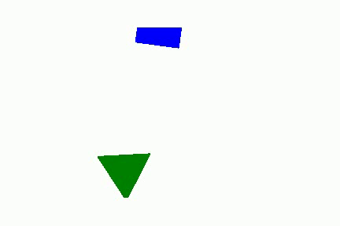

# random_footages

# Introduction

This repository is a side project of mine that aims to generate random videos more or less fluids.  
These videos are made out of frames. And those frames out of polygons of different colors.  

# Process explained 
## Generation of n frames
To achieve this, I first create n random frames. By random, I mean that I randomly choose some parameters over my polygons.  
Their centers for instance. All this frames are then stored in a directory.  

## Distances between theses frames
From these frames, I wanted to create the videos that looks the most fluid for human eyes. So I decided that I will measure the inverse distance between two frames by the following function :
 
 

 
 
where polygon1 and polygon2 are two polygons of same color from frame1 and frame2.
 
This distance (induced by the inv_distance) does not really have the classic distance properties. For instance distance(frame1,frame1) is not equal to 0.  
But it has the property of order I want, so I will keep it as so.
 
This is deeper explained in the jupyter notebook video_generator.ipynb

## Create the video by ordering frames
The first frame of the video is randomly chosen from all frames generated.  
As a second frame, I want the closest image for my distance from all frames generated.  
The process is repeated n times. At the first iteration, n-1 distance are computed. At the second, n-2 ... 
This algorithm gives a new order to our n randomly generated frames that makes it looks fluid as a video. 
 

## Comments
One can repproach the really long time to compute a video (factorial n distances computated). And to make it faster and simpler with only n distances computated, one can also propose the order induced by the distance between the first frame and all the others. But I assumed it would create a far less fluid videos.  
To recconcile these two approaches, we could also process the n frames by batches (let's say of size m). At the first iteration, the m closest frames to the first frame are chosen to be the m next frames on the video. And the process is repeated until no more images. 
At the first iteration n distances are computed, but at the second n-m, at the third n-2m ...  
A lot less iterations are then required to give a new order.
 
 
To make the video even more fluid, I thought to a post treatment.  
Given a frame in the video and the following one, we can create a frame where the polygons centers are taken as barycenters of the polygon1 and polygon2.  
This newly created frame is added in between the two frames it has been created from.  
I guess that add fluidity but it has not been yet tested. And this process can be repeated many times.

## Two different ways of storing the generated objects

Concerning the way frames are stored after being created. Two approaches have been used. 
First and because I am used to dealing with proximity between frames, by looking into their RGB codes. I decided to save each frames as a png file. The proximity between two frames was then computed given the RGB code of this two frames. Each pixels were compared. Which I supposed slow down the generation.  

The second approach was to store the polygon objects of a frame as pickle file. To compute the distance between two frames, it is a python intersection between polygons that is used.  

The first approach allows me to draw circle, while the second makes it more difficult.  
The intersection between a triangle and a square is a polygon but what is the intersection between a circle and a square ?

# Results

Below some results are showed :

The first created frame :  

 

Then I realised, it was simpler to use green instead of yellow (because of the rgb encoding of my png files) :
 

  

Because the area of the circle dominates the others, we follow the movement of the red dot.
 
 
I reduced the size of the red dot and randomized the angles.
 
 

Simply a square and a triangle.
 

  
On each frame of this one, a parameter p is drawn randomly in [0;1]. The size of the triangle is then p and the square 1-p. 

